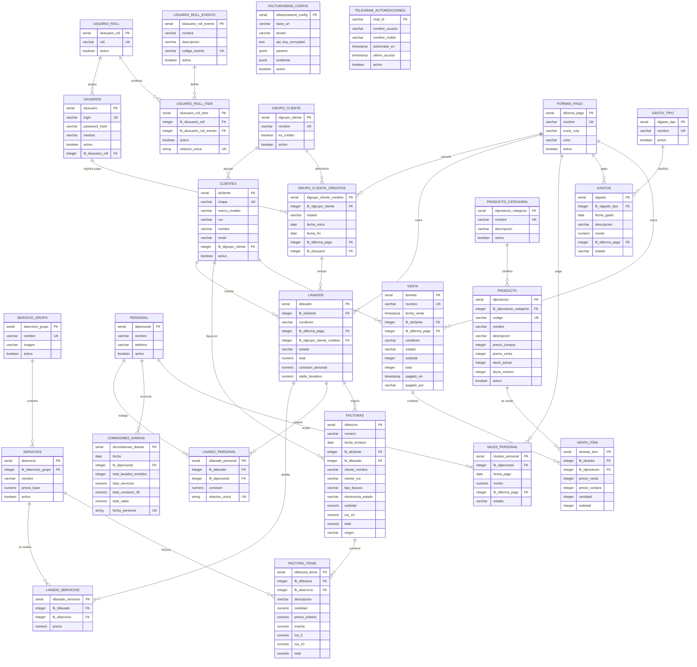

# Diagrama entidad-relación

Este diagrama representa el esquema final de la base de datos después de ejecutar las migraciones hasta `043_ventas_productos.sql`.

Las tablas y columnas `legacy` de migraciones anteriores no forman parte del modelo vigente. Las claves foráneas opcionales se identifican en los atributos.

Versión editable en [FigJam](https://www.figma.com/board/o8qw286oqVWPFVdD1P5xQU).

## Convenciones

- `PK`: clave primaria.
- `FK`: clave foránea.
- `UK`: restricción única.
- Las FK que pueden estar vacías son: `clientes.fk_idgrupo_cliente`, `lavados.fk_idgrupo_cliente_creditos`, `facturas.fk_idcliente`, `facturas.fk_idlavado`, `factura_items.fk_idservicio` y `venta.fk_idcliente`.
- `FACTURASEND_CONFIG` y `TELEGRAM_AUTORIZACIONES` no tienen relaciones FK con otras tablas en el esquema actual.
- `VENTA.condicion` admite `CONTADO` y `CREDITO`; `VENTA.estado` admite `PENDIENTE`, `PAGADO` y `ANULADO`.
- Los precios, stock y cantidades de productos y ventas se almacenan como enteros.
